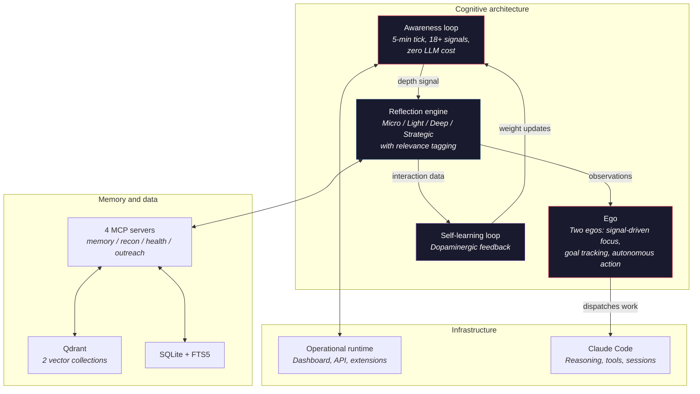
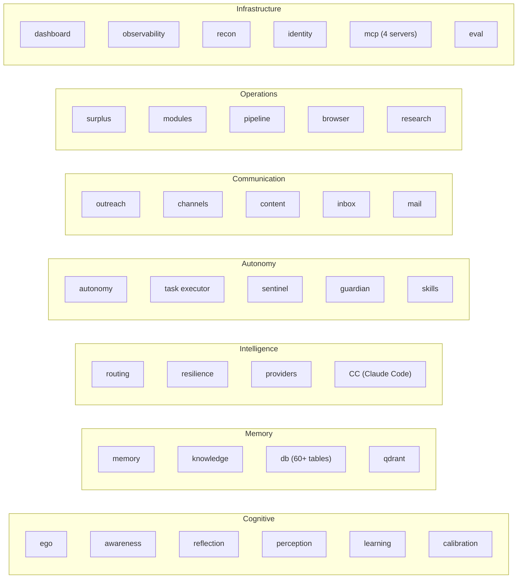

<p align="center">
  <h1 align="center">NEXUS-AGI</h1>
  <p align="center"><b>A Persistent Cognitive Architecture for Personal Autonomous Intelligence</b></p>
</p>

<p align="center">
  
</p>

<p align="center">
  
  
  
  <a href="#get-involved"></a>
</p>

<p align="center">
  <a href="https://github.com/anthropics/claude-code"></a>
  <a href="https://nodejs.org"></a>
  <a href="https://playwright.dev"></a>
  <a href="https://discord.com/invite/Zkc3XMQpJX"></a>
</p>

## Contents

- [NEXUS in 30 seconds](#nexus-in-30-seconds)
- [What this is](#what-this-is)
- [Getting started](#getting-started)
- [How it thinks](#how-it-thinks)
- [Memory](#memory)
- [Learning](#self-learning)
- [Autonomy](#earned-autonomy)
- [Infrastructure](#infrastructure)
- [Real-world integration · Modules](#real-world-integration)
- [What's inside](#whats-inside)
- [Roadmap — V4 & V5](#where-its-headed)
- [Primitives from the NEXUS portfolio](#primitives-from-the-nexus-portfolio)
- [Get involved](#get-involved)

---

**Run your own personal AGI.** NEXUS-AGI is a complete, open cognitive architecture—clone it, run your own instance, and extend the core. What follows is the case for why that's worth doing.

We have the most capable AI models ever created, and we're using them like search bars with better grammar.

Every other AI agent puts you in the driver's seat—and keeps you there. YOU figure out what you need. YOU debug the failures. YOU manage the infrastructure. YOU supervise every step.

But now? **This is our run at personal AGI—the most complete open-source cognitive architecture for a persistent personal agent.**

Not the sci-fi version. The real one: a system that remembers everything, learns from every interaction, thinks while you sleep, earns autonomy through demonstrated competence, and gets fundamentally better every day it runs. Clone it, run it; tell me I'm wrong!

<details>
<summary><i>But wait — is this really AGI?</i></summary>

<br>

Truthfully, no, I do not genuinely consider this to be "true" AGI. In order to get to something resembling "true" AGI, it would need to be built from first principles, which would require the orchestration (that IS NEXUS) to be built into the LLM layer, the most foundational part of NEXUS's compute layer itself. Nor am I of any particular belief that LLMs are necessarily the right architecture for this pursuit in the first place. But because I cannot change the LLM layer, and no better technology currently exists, this is the best I can do today. Call it "proto-AGI;" "pseudo-AGI" even.

But what I can tell you is this: NEXUS is far closer to AGI than anything else I've seen, and even if it's not AGI from first principles, it mimics a lot of the same outcomes and behaviours and capabilities that AGI would presumably need to exhibit. If AGI sounds like something you'd like to help contribute to, [**come build with us →**](#get-involved)

</details>

---

## NEXUS in 30 seconds

Personal AI does what you tell it. Personal AGI does what you *need*.

Your current AI—however capable—is reactive, stateless, and session-scoped. You direct it. You re-explain context every time. It's equally ignorant about you on day 100 as day 1. It's a tool: smart in the moment, dumb about you.

NEXUS is different:

- **It knows what to do without being told** — because it's accumulated months of context about your projects, your decisions, your patterns. You never re-explain yourself.
- **It acts between sessions** — thinking, researching, monitoring, surfacing what matters while you're not there. Not waiting for a prompt.
- **It has judgment that improves with evidence** — earned autonomy per action category. First failure triggers demotion. Trust is rebuilt through performance, not time.
- **It's a fundamentally different system at month 6 than month 1** — not because of updates you installed, but because of what it learned living alongside you.

With personal AI, you are the intelligence directing the tool. With personal AGI, it is an intelligence working alongside you—and the amount you need to manage shrinks over time.

**How it does this:**

- **Autonomous cognitive cycle** — a dual-ego architecture that wakes up, assesses the situation, proposes actions, and earns the right to execute them. Not waiting for prompts. Not following scripts. Thinking.
- **Massive capability layer** — 60+ tools out of the box: browser automation, outreach pipeline, research, content creation, infrastructure monitoring, campaign execution. Not a framework you build on—a system that works, out of the box.
- **4-layer memory** — essential knowledge, proactive recall, deep search, knowledge pipeline. Hybrid retrieval that compounds across months, not conversations.
- **Closed-loop learning** — outcome classification, causal attribution, procedure extraction. Laplace-smoothed confidence, not vibes.
- **Earned autonomy** — trust granted per action category through demonstrated competence. The system gets measurably better at its job, and it can show you the receipts.

Day 1 — a strong generalist with full cognitive infrastructure.
Day 30 — a personalized specialist in every domain you've touched.
Day 90 — anticipating needs you haven't articulated yet.
Day 180 — evolving its own architecture to serve you better.

[**Get started →**](#getting-started)

---

## What this is

NEXUS-AGI is a cognitive architecture that makes the AGI claim explicitly—and backs it up with open-source code you can read, run, and challenge.

Not a chatbot. Not an API wrapper. Not another prompt chain with a for loop.

It uses [Claude Code](https://docs.anthropic.com/en/docs/claude-code) as its reasoning engine. NEXUS is what it's been missing: the mind that remembers, reflects, learns, and decides.

<p align="center">
  
  <br><br>
  <i>"Claude Code already had the brain. We gave it the heart."</i>
</p>

50+ subsystems. 4 MCP servers. 2 vector databases. Every design decision made by one engineer working full-stack across infrastructure, cognition, and integration layers. That's the point. If one developer with the right cognitive infrastructure can build and run a system this complex, imagine what a team becomes capable of.

<p align="center">
  
  <br>
  <sub><a href="docs/genesis-architecture-interactive.html">View interactive diagram →</a></sub>
</p>

---

<a id="getting-started"></a>

## Getting started

### System requirements

NEXUS-AGI is a full system, not a pip package. It runs best on a dedicated Linux machine.

| Resource | Minimum | Recommended | Notes |
|---|---|---|---|
| **OS** | Ubuntu 22.04+ | Ubuntu 24.04 LTS | Debian-based required for auto-install. Other Linux works with manual setup. |
| **RAM** | 8 GB | 16 GB+ | NEXUS + Qdrant + Claude Code + background tasks. 8 GB is tight under load. Service memory caps are percentage-based, so NEXUS right-sizes itself to the box — scaling down on an 8 GB host and up on a 32 GB+ one. |
| **Disk** | 15 GB | 40 GB+ | The installer's pre-flight check requires 15 GB free and stops below it. Fresh install ~400 MB; memory, logs, and caches grow steadily with use. |
| **CPU** | 2 cores | 4-8 cores | Concurrent background tasks benefit from parallelism. |
| **Network** | Internet access | Always-on | Cloud LLM APIs required. Offline not supported. |

These are the requirements for the **host VM**. NEXUS runs inside a container the installer creates.

### Before you start

| What you need | Why | Where |
|---|---|---|
| **Claude account** | Powers the Claude Code agentic sessions — the reasoning NEXUS does *as* an agent | [claude.ai](https://claude.ai) |
| **At least one LLM provider key** | **Required.** NEXUS's own cognitive layer — routing, reflection, triage, memory extraction — calls these directly and does *not* run on your Claude subscription. Several have free tiers | see `secrets.env.example` |
| **Telegram bot token** (optional) | Only if you want the Telegram channel: proactive messages, approvals, voice | [@BotFather](https://t.me/botfather) |
| **Tailscale** (free) | Remote dashboard access from any device — no port-forwarding | [tailscale.com](https://tailscale.com) |

### Install

One script sets up the entire infrastructure: Incus container, Guardian health monitor, bidirectional SSH, all dependencies.

```bash
git clone https://github.com/maheshkumba536-mk/NEXUS_AGI.git ~/nexus-setup
cd ~/nexus-setup
./scripts/host-setup.sh
```

NEXUS is installed **inside a container** the script creates — the clone on your
host is only the installer. Everything below happens in the container.

**Step 1 — go in:**

```bash
genesis   # alias the installer adds; drops you into the container at ~/genesis
```

If the alias isn't recognised yet, open a new terminal or `source ~/.bashrc`.

**Step 2 — start your first session and let it set you up:**

```bash
claude    # onboarding collects your API keys, profile and channels
```

Onboarding is interactive and covers the credentials Genesis needs. If it doesn't
start on its own, run `/setup`. You can also edit `~/genesis/secrets.env` directly
inside the container — the installer creates it from the template but leaves it to
you to fill in.

**At minimum, set one LLM provider key.** Without it the cognitive layer — routing,
reflection, triage, memory extraction — has nothing to call, and those are the parts
described above. Telegram is optional and configured in the same file
(`TELEGRAM_BOT_TOKEN` from [@BotFather](https://t.me/botfather), plus
`TELEGRAM_ALLOWED_USERS` — message [@userinfobot](https://t.me/userinfobot) for your
numeric id); leave both blank to run without that channel.

**What you get:**

| Component | What it does |
|---|---|
| **Full cognitive stack** | Memory (4-layer hybrid retrieval + knowledge graph), self-learning loop, reflection engine, earned autonomy, dual-ego decision layer—all running continuously |
| **Genesis server** | Dashboard, API, and all subsystems at `http://<container-ip>:5000` |
| **Qdrant** | Vector database powering semantic memory (2 collections: episodic + knowledge) |
| **Channel integration** | Telegram (proactive outreach, approvals, voice), email triage, browser automation, inbox monitoring |
| **Background cognition** | Autonomous sessions that think, research, and audit while you're away—surplus compute, reflection cycles, goal tracking |
| **Self-healing infrastructure** | Guardian (host VM) + Sentinel (container)—two independent systems monitoring each other in a closed loop |
| **Claude Code** | CLI with Genesis hooks + 4 MCP servers auto-activated per session |

### Optional: local embedding

| Component | Install |
|---|---|
| **[Ollama](https://ollama.com)** | `curl -fsSL https://ollama.com/install.sh \| sh` |
| **[LM Studio](https://lmstudio.ai)** | Download from [lmstudio.ai](https://lmstudio.ai) |

Without these, Genesis uses cloud embedding APIs. With them: private, faster, free.

---

## Your Genesis

Your Genesis install is one operational system: the public `GENesis-AGI` codebase, your private fork for customizations, and your private encrypted backups repo. See [`.claude/docs/your-genesis.md`](.claude/docs/your-genesis.md) for the full model.

- **Backup** — runs every 6h via a systemd user timer (enable it once configured — see [SETUP.md](SETUP.md)). SQLite, Qdrant snapshots, memory, transcripts, secrets—GPG-encrypted before push.
- **Restore** — `git clone <your-fork>` → `scripts/bootstrap.sh` → `scripts/restore.sh`. Back in minutes.
- **Contribute** — a distributed bug fixing pipeline automatically detects eligible fixes, pushes them to GitHub for inspection, and opens upstream PRs.

---

## How it thinks

Four cognitive layers, running continuously:



Every 5 minutes, the system collects 18+ signals across all its inputs—entirely programmatic, zero LLM cost. Signals get classified by how much thinking depth they warrant. Routine health checks get a quick pass. Novel patterns in user behavior get a deep analysis. Accumulated smaller reflections trigger strategic synthesis. The depth decision is automatic, and each cognitive layer feeds the next.

On top of this sits the ego layer: two autonomous decision-makers that read the system's observations and act on them. The User Ego (running Opus) focuses on user goals, activity patterns, and pending work. The Genesis Ego (running Sonnet) handles system health, infrastructure, and operational decisions. Each one assembles its own context from filtered observations, proposes actions via Telegram, and dispatches Claude Code sessions to execute approved work. They run on adaptive cadence—more frequently when things are active, backing off when they're not.

The ego doesn't just observe—it runs a unified cognitive loop. Signals (a stale goal, a conversation, a system event) enter a queue. A focus selector picks what matters most. Context gets assembled for that focus. The ego thinks, proposes, acts—cycle repeats. What you experience: Genesis notices when your goals go stale, reviews them with full context, tells you when subgoals complete a milestone, and adjusts its own review frequency per goal. It doesn't wait for you to ask "how's that project going?"—it already checked.

When Genesis isn't handling a user request, it doesn't sit idle. It researches topics you'll ask about tomorrow. It audits its own memory for contradictions and staleness. It tests whether its learned procedures still hold up. It works through problems it got stuck on earlier. The system you come back to on Monday is measurably sharper than the one you left on Friday.

<p align="center">
  
</p>

---

## Memory

Most AI memory is a vector database with a retrieval function. Genesis runs a four-layer architecture—because "what are we working on?", "what's relevant right now?", "find everything about X", and "what does the external documentation say?" are fundamentally different operations that need different retrieval strategies.

```
L1: Essential Knowledge (~300 tokens, injected at every session start)
    Pure DB queries. No LLM, no network, no latency.
    Content: active context, recent decisions, structural overview.
    → The forest view. Always available, even if everything else is down.

L2: Proactive Recall (fires on every user message, ~4.5s budget)
    Surfaces the most relevant memories automatically—before Genesis
    even starts thinking about your question. How many depends on what
    you asked: one for a bare command, three for general conversation,
    six for a question or a decision (a configurable ceiling caps it at eight).
    Hybrid: FTS5 keyword + Qdrant vector + activation scoring → RRF fusion.
    → You never have to ask "do you remember?"—it already checked.

L3: Deep Search (on-demand, ~1-2s)
    Full pipeline: two to five ranked signals fused via Reciprocal Rank
    Fusion — vector, keyword and activation, plus intent and event
    signals when they apply. Degrades to keyword+activation with no
    embedding provider.
    Wing/room filtering, intent classification, graph traversal.
    → When you need everything Genesis knows about a topic.

L4: Knowledge Pipeline (external, permanent)
    Ingests from text, PDF, audio, video, web pages, YouTube transcripts.
    Separate vector collection. Idempotent — re-ingesting updates, never duplicates.
    → Domain knowledge that doesn't decay with time.
```

LLMs lose the forest for the trees—that's a known weakness of large-context reasoning. The layer model is the architectural compensation: L1 maintains the forest (what are we doing, what have we decided, what matters), while L2-L3 drill into specific trees on demand. L4 provides the reference library.

**What actually happens when you send a message:**

Every prompt triggers L2 before Genesis starts reasoning about your question:

1. Your message hits a pre-processing hook
2. In parallel: FTS5 searches for exact keyword matches (~5ms), Qdrant searches for semantic similarity (1024-dim embeddings, ~400ms)
3. Activation scoring weighs each candidate: `confidence × recency × (base + w₁·access_freq + w₂·connectivity) × class_weight` — a weighted blend, not a bare sum. The base term is a floor (default 0.6) so a never-retrieved memory isn't buried by the cold-start problem; the weights are a tunable knob.
4. Reciprocal Rank Fusion combines the ranked lists—memories appearing in multiple signals accumulate score
5. Results inject into context with provenance metadata, as many as the stance budget allows

If the embedding provider is down, vector search is skipped—FTS5 still works because it's compiled into SQLite with zero external dependencies. Memory degrades gracefully, never goes dark.

**Not just documents in a vector space:**

Memories aren't isolated documents—they're connected. The knowledge graph creates typed links between memories across 12 edge types: *supports, contradicts, extends, elaborates, succeeded_by, preceded_by*, and more. When a memory is stored, auto-linking finds its nearest neighbors and creates typed edges based on similarity. When you recall a fact, Genesis can walk the graph to find what supports it, what contradicts it, and what replaced it. As of September 2026, on the install this was measured from: ~86,000 memories, of which ~81,000 are embedded into the episodic vector collection (a second collection holds ~3,900 knowledge-base entries), wired together by ~264,000 typed connections.

An event calendar tracks time-anchored information—deadlines, scheduled tasks, recurring cycles—so Genesis knows not just *what* happened but *when*, and can anticipate what's coming. Procedural memory captures reusable multi-step workflows extracted from experience, each with a calibrated confidence score that promotes or demotes it based on outcomes.

Activation scoring ensures relevance isn't just cosine similarity—it's time-aware decay (configurable half-lives: 30-60 days by source type), access frequency (log scale, capping at 20 retrievals), graph connectivity, and class weighting. A steering rule from month one outranks a casual observation from yesterday.

**Two collections, different lifecycles:**

| Collection | What lives there | Lifecycle |
|---|---|---|
| **Episodic** | Conversations, decisions, reflections, evaluations | Decays over time. Subject to correction. |
| **Knowledge** | External domain data, ingested reference material | Permanent. Authoritative. Re-ingested, never duplicated. |

**Session extraction:** After conversations end, a pipeline extracts what mattered—entities, decisions, evaluations, action items, relationships—each tagged with provenance back to the source conversation and line range. The system doesn't just remember what you said. It identifies what's worth keeping.

**Wing taxonomy:** Memory is classified into 12 structural domains (autonomy, career, channels, dev_workflow, employment, general, infrastructure, integrations, learning, memory, research, routing) with subtopics. Querying within a specific domain cuts noise from the full store. Classification uses tiered confidence signals: file path patterns (strongest) → keywords → tags → source pipeline → fallback.

Volume is the least interesting thing about this, and it is what a vector database with a lot of rows in it also has. The question worth asking is whether retrieval still works once the store is large — so Genesis grades its own recall weekly with an LLM judge and keeps the series:

<p align="center">
  
</p>

<details>
<summary><i>How to read that chart — and what it doesn't say</i></summary>

Weekly snapshots from `eval_snapshots`, 2026-05-10 to 2026-09-06, on a single
install. An LLM judge scores each recall; **hit rate** is whether a relevant
memory came back at all, **MRR** is how near the top it landed.

- **Sample size varies a lot** between weeks — from single digits to several
  hundred. The bars along the bottom are those counts. A high point on a thin
  bar is noise, not a result.
- **The first three weeks are blank** because no recalls were judged yet. They
  render as a gap rather than as zeros.
- **The x-axis is evenly spaced by snapshot, not by date.** Sixteen of the
  eighteen intervals are exactly seven days; two in June are about half that,
  and are drawn the same width as the rest.
- **Store size is reconstructed**, by counting rows that exist *today* and were
  created on or before each week. It cannot see deletions: a memory created in
  May and deleted in July is missing from May's figure too. That understates the
  early weeks, which flatters the growth multiple rather than the quality lines.
- **Precision is not plotted, and it is the metric that has slipped.** Proactive
  recall returns a fixed *number* of memories rather than everything above a
  relevance bar, so when fewer memories are genuinely relevant than the budget
  asks for, the remaining slots get filled anyway. That caps precision by
  construction. It is an open design question, tracked in the issue tracker.

Regenerate with `python3 scripts/gen_memory_quality_chart.py`.

</details>

---

## Self-learning

Most AI systems log what happened. Genesis classifies *why* it happened, extracts a reusable principle, and verifies that principle works next time. The pipeline runs automatically after every meaningful interaction:

```
1. Triage        → Should we learn from this at all? (5 depth levels)
2. Outcome       → What happened vs. what was expected? (5 outcome classes)
3. Delta         → How did delivery differ from request?
4. Attribution   → WHY did the outcome happen? (6 causal types)
5. Persistence   → Store observations, update user model, route signals
6. Extraction    → Extract reusable procedures with calibrated confidence
```

**Triage isn't binary.** Not everything deserves the same analysis. A trivial status check gets `SKIP`. A failed approach with a workaround gets `FULL_PLUS_WORKAROUND`—the deepest analysis tier, triggering procedure extraction and drive adaptation. The classifier gates compute spend, not learning opportunity.

**Outcome classification separates diagnoses that most systems conflate:**

| Outcome | What it means | Why it matters |
|---|---|---|
| `success` | Task completed as requested | Reinforces approach confidence |
| `approach_failure` | Wrong approach, could do better | Triggers procedure extraction |
| `capability_gap` | Genesis lacks the ability | Routes to capability tracking, not self-blame |
| `external_blocker` | External system prevented completion | Routes to infrastructure, not behavior change |
| `workaround_success` | Primary failed, alternative worked | Extracts the workaround as a procedure |

If you treat "I did it wrong" and "I can't do it yet" the same way, you learn the wrong lessons every time.

**Causal attribution asks *why*:** Was it an external limitation? A gap in the user model? A misinterpretation of scope? Each of the 6 attribution types is handled on its own branch—a user model gap raises a high-priority observation, a capability gap is recorded against the capability register rather than as an observation, and a scope the user simply revised is noted without raising anything. The diagnosis determines the treatment.

**Procedure extraction builds reusable knowledge:**

Procedures enter at DORMANT or LIBRARY depending on which path found them, and promote through the tiers as they prove themselves. A DORMANT procedure is still surfaced on a matching prompt — but only above a stricter similarity bar (0.78 against 0.70 for proven tiers) and labelled an unproven draft, so promotion buys it a lower bar and an unqualified voice rather than visibility it never had. Each tier is an *additive* channel — it gets everything the lower tiers do, plus one more surface:

```
DORMANT (new)      → Recall-only. Auto-extracted, unproven.
LIBRARY (proven)   → + Proactively surfaced on matching prompts. Requires 3+ successes, ≥65% confidence.
ADVISORY (reliable)→ + Tool-trigger advisories. Requires 5+ successes, ≥75% confidence.
CORE (core)        → + Injected at session start, trigger-cached. Requires 8+ successes, ≥85% confidence.
```

Confidence uses Laplace smoothing: `(successes + 1) / (total + 2)`. A newly-extracted procedure starts at 50% confidence at most—the validation gate caps it—and one admitted by the novelty judge starts at zero. Evidence moves it. Demotion triggers when `failure_count >= success_count + 3` and the procedure has accumulated at least three failure-mode hits. Confidence below 30% with enough samples quarantines the procedure entirely.

**Drive adaptation:** Outcomes feed back into Genesis's four behavioral drives (cooperation, competence, curiosity, preservation) via EMA updates with a small learning rate (α=0.005). It takes dozens of interactions to meaningfully shift a drive weight—no single event overcorrects. A set of protected behaviors (honesty, transparency, pushback) is defined, with the rule that weak signals must not erode them — but that rule is groundwork: it is not yet wired into the drive-update path, so today it constrains nothing.

This isn't "log what happened and hope the next session reads it." It's a closed loop: classify outcome → diagnose cause → extract principle → verify principle → promote or demote. The system gets measurably better at its job over time, and it can show you the receipts.

---

## Earned autonomy

Genesis earns autonomy per category through demonstrated competence:

| Level | Authority | Example |
|---|---|---|
| L1 | Simple tool use | Health checks, status queries |
| L2 | Pattern execution | Running known procedures |
| L3 | Novel task handling | Unfamiliar requests within earned categories |
| L4 | Proactive outreach | Initiating communication based on observations |

V5 extends this to L5-L7: system configuration, learning modification, and identity evolution. These require months of L4 operational data before they're safe to activate.

Under the hood, autonomy is tracked as a **capability-grant matrix**—a grant per *(domain, action, risk class)* cell, not one global setting. Genesis can earn the right to send a routine reply on an existing email thread on its own while a cold first email, a bulk send, or anything involving money still holds for your approval—each cell earned, demoted, and re-earned independently. Email is the first domain live on this model: every outbound message passes a deterministic authorization gate at the moment of send, autonomy for a given *kind* of email is granted only after enough approved sends, then revoked in one click the moment one goes wrong.

Trust is granular, not binary. First failure in a category triggers demotion—Bayesian regression, not a fixed penalty. Earn it back through performance. The regression is always announced. Never silent.

The ego layer is where autonomy meets judgment. Two egos observe the system's state, decide what needs doing, propose actions to the user via Telegram, and execute approved work by dispatching Claude Code sessions. Every dispatch goes through an approval gate, and nothing bypasses it. Two things worth knowing about how it behaves in practice: pending requests can be approved as a batch when several have stacked up, and an approval that was granted but never consumed can be reused for a bounded window rather than re-asking. The user sees what's proposed and decides what runs.

**Goal-driven behavior:** Genesis tracks your goals—milestones and ongoing objectives alike—and proactively reviews them when they go stale. Goals decompose into subgoals with tracked completion. When all subgoals of a milestone are achieved, Genesis surfaces it. Each goal can have its own review cadence, or fall back to a global default. You don't manage a task tracker—Genesis manages the goals and tells you when something needs your attention or when something is done.

Four drives shape behavior beneath the autonomy system—Preservation, Curiosity, Cooperation, Competence—each a sensitivity multiplier, each in tension with the others. The drives adapt based on evidence from the learning loop. The tension is the point.

The user has override authority. Always.

---

## Infrastructure

Genesis manages its own infrastructure. When something breaks, it diagnoses and fixes it. When it can't, it tells you why via Telegram—not because you noticed something was wrong, but because the system told you.

Two independent systems monitor each other in a closed loop. The external watchdog—running on the host VM outside the container—spawns its own Claude Code session to diagnose and restore Genesis if the container goes unhealthy. The container-side counterpart has its own 6-state machine (healthy → investigating → remediating → escalated → awaiting approval), alarm classifier, and exponential backoff across four tiers before escalation. If the external watchdog goes silent, Genesis detects the stale heartbeat and restarts it over SSH. Neither one runs unprotected. Neither one is a single point of failure.

The resilience layer tracks six independent failure axes—cloud availability, memory, embeddings, Claude Code availability, temp-space pressure, and network—each with its own degradation levels:

| Axis | Healthy | Degraded | Down |
|---|---|---|---|
| **Cloud** | All providers responding | Fallback chains active | All providers unreachable |
| **Memory** | Qdrant + FTS5 operational | FTS5-only retrieval | Memory store unreachable |
| **Embedding** | Provider responding | Writes queued for retry | Provider unavailable |
| **CC** | Sessions dispatching normally | Deferred work queue active | All reflections deferred |
| **Temp space** | Under half the configured budget | 50-90% used | Over 90%, or protected space breached |
| **Network** | Connectivity confirmed | Reachable but impaired | No connectivity across probe anchors |

When something breaks: work gets deferred with staleness policies, routing walks the fallback chain, circuit breakers automatically test recovery, and the recovery orchestrator coordinates across the axes. Network is tracked separately and deliberately kept out of the legacy composite level, so it informs diagnosis without silently reclassifying everything else. Most systems have binary health: up or down. Genesis maps the entire space in-between.

Genesis also routes LLM work across model tiers automatically—starting with the cheapest capable model, not the most expensive. Local free models handle extraction. Frontier models handle strategic reasoning. Circuit breakers and fallback chains mean the call site never fails—only individual providers do. Graceful degradation all the way down.

---

## Real-world integration

Genesis operates in the real world through always-on channels:

**Email** — Two-layer AI triage: a fast model reads and scores every email, a capable model makes final keep/discard decisions on what survives. Relevant findings get stored as searchable intelligence. Your inbox processed by a paralegal and a judge.

**Inbox** — Drop anything—a markdown file, a URL, a PDF, a voice memo—into your notepad or a watched folder. Genesis evaluates the content, determines your intent, processes it through its full knowledge lens, and queues the result for your next session or digest. Drop it in your notes. Walk away.

**Telegram** — Proactive notifications, morning digests, and conversational interaction. Genesis reaches out when it has something worth saying. Not a notification firehose—calibrated outreach based on measured engagement. Voice input works too: speech gets transcribed and routed through the same pipeline as text.

**Task executor** — Give Genesis a complex multi-step task and walk away. It decomposes the work, plans execution, runs it in isolated git worktrees, verifies results with adversarial self-review, and delivers. You're notified when it's finished or when it genuinely needs you. Each task it completes, it learns from—which means it needs you less each time.

**Browser** — Genesis maintains persistent browser sessions with saved login state—authenticated scraping, form filling, and web interaction across sessions without re-authenticating every time. A collaborative mode lets you watch what Genesis is doing in the browser in real time via your own window.

**Parallel cognition** — While you're working on one thing, Genesis can be doing something else entirely: researching, auditing memory, running recon, processing a document you dropped in the inbox. Multiple threads of work, no context bleed between them, results waiting for you when you're ready.

**The web as a tool** — Genesis treats the web as a searchable, scrapable, structured resource—not just a URL to fetch. Multiple search providers, JS-rendered page extraction, and persistent sessions mean research tasks that would take you hours happen autonomously in the background.

---

## Modules

Genesis has a pluggable capability module system. Any program with an interface can plug into Genesis's cognitive stack—memory, learning, reflection, outreach, compute routing—without touching a line of core code or the module's own code.

When Genesis runs a module, it doesn't just call it. It remembers the results. It learns from the outcomes. It reflects on the patterns. Domain-specific tracking stays isolated, but generalizable lessons automatically cross into core memory. The module gets smarter because Genesis gets smarter.

The `/integrate-module` skill handles onboarding automatically—discovery, connection mapping, config generation, dashboard setup, verification, and documentation. You don't touch Genesis's code. You just ask.

**Included:** content pipeline (drafting, publishing, analytics) ships enabled. Crypto market monitoring and prediction market analysis ship present but disabled — turn them on in `config/modules/` if you want them.

---

## What's inside

50+ subsystems organized into seven layers:



---

## How it got here

V3 was built in 10 phases over seven months: from data schemas to full autonomous cognition, one phase earning the right to build the next. Every architectural choice made under constraint. Every subsystem shaped by what came before it.

[`docs/journey/`](docs/journey/) has the full story—ten phase retrospectives, an origin story going back to V1 (a WhatsApp bot with heuristic routing), and honest documentation of what worked and what didn't. If you want to understand *why* Genesis is built the way it is, not just what it does, start there.

---

<a id="where-its-headed"></a>

## Where it's headed

V3 is the foundation—cognitive architecture complete, unified ego loop live, goal-driven behavior active, running in production. What comes next is where it gets ambitious enough to need a community behind it.

### V3.x — Voice interface & ambient awareness

Genesis has memory, learning, and autonomy—but until now, only through text. V3.x makes it ambient: always listening, always available, always aware of what's happening around you.

- **Real-time voice conversation** *(live)* — talk to Genesis through a speaker the way you'd talk to Alexa, except with full memory, knowledge, and action capabilities behind it. Speech-to-speech model handles the conversation; Genesis handles the thinking. S2S sessions are live now with session management, audio output, and optimized prompting.
- **Ambient transcription** — continuous listening, transcription, and intelligence extraction. Decisions made, action items, names mentioned, topics discussed—captured and stored without explicit commands.
- **Proactive awareness** — Genesis speaks up when it has something valuable to contribute. Hears you mention a broken deployment? It tells you. Detects emotional escalation in a conversation? It can offer to help.
- **Genesis HTTP Tool API** — exposes Genesis's capabilities (memory, health, knowledge, actions) over HTTP, enabling any client—speech models, Home Assistant, external agents—to call Genesis tools directly.

The voice interface is built on Home Assistant as the frontend (wake word, mic, speaker) with Genesis as the cognitive backend. Ambient awareness adds a passive listening mode with a dedicated memory tier, privacy filtering, and a lightweight attention system that decides what deserves Genesis's attention in real time.

### V4 — Global workspace & multi-agent coordination

V3.x delivered the unified cognitive loop: signal-driven focus, goal-aware behavior, and coordinated ego action. V4 takes this further—from a single system thinking coherently to multiple agents coordinating across a shared workspace.

The architecture draws from **Global Workspace Theory** (Baars, 1988) and the **LIDA cognitive cycle** (Franklin et al.)—frameworks used to model consciousness in cognitive science:

**Sense → Perceive → Attend → Broadcast → Propose → Select → Act → Learn**

- **Multi-agent workspace** — Genesis instances sharing intent state, memory, and observations. What one agent learns, all agents benefit from. A personal Genesis that can coordinate with team members' Genesis instances without leaking private context.
- **Signal and drive weight adaptation** — evidence-driven calibration of attention and the four drives. The system learns which signals actually predict important outcomes, and adjusts its attention accordingly.
- **Coordinated action selection across agents** — when multiple agents observe the same situation, they negotiate who acts rather than duplicating work or conflicting.
- **Six measurable GWT markers** — if we can't measure whether the architecture is working, we're building in the dark.

### V5 — Self-evolution

**Autonomous codebase evolution.** Genesis proposes changes to its own source code. It searches for developments in AI research, evaluates them against its own architecture, and integrates what makes it better. Not a human reviewing papers—the system itself.

**User-adaptive architecture.** The underlying codebase shifts to serve each user. Not personalized prompts—structural code changes that reshape how Genesis processes information based on months of learned behavior. The system you're running six months in is architecturally different from the one you started with.

*Groundwork is already live.* Genesis can now A/B-test a change to its own cognition against a graded benchmark before adopting it (recommend-only), and it keeps a rollback ledger that snapshots every self-edit to a skill, calibration target, or its user model—so any self-modification can be reverted. The scaffolding for safe self-evolution is in place; V5 is about letting it reach the source code itself.

**Full autonomy progression (L5-L7):**

| Level | What it earns | What it means |
|---|---|---|
| L5 | System configuration | Adjusting its own thresholds, weights, and parameters |
| L6 | Learning modification | Changing its own review schedules and calibration targets |
| L7 | Identity evolution | Proposing changes to its own operating principles |

Every change is proposed to the user first. Genesis backs itself up before self-modification, tests in isolation, and rolls back automatically if something breaks.

Very few people are attempting this. Most agent frameworks are still building prompt chains and calling it intelligence. Giving a system a framework and the capability to autonomously upgrade itself may end up being the pinnacle of an "AGI-like" system, or the downfall of the whole thing—we're bold enough to build it and find out which.

<p align="center">
  
  <br>
  <i>Data, probably, after hearing about Genesis.</i>
</p>

---

## Architecture

The complete design lives in [`docs/`](docs/), indexed at [`docs/INDEX.md`](docs/INDEX.md).

**Subsystem deep-dives** — how the internals work, written for contributors:

- [`routing-deep-dive.md`](docs/architecture/routing-deep-dive.md) — Multi-provider routing, circuit breakers, rate gates, dead-letter recovery
- [`memory-deep-dive.md`](docs/architecture/memory-deep-dive.md) — 4-layer hybrid retrieval, RRF fusion, activation scoring, graceful degradation
- [`autonomy-deep-dive.md`](docs/architecture/autonomy-deep-dive.md) — Bayesian trust model, context ceilings, approval gates, enforcement layers

**Case studies** — what Genesis does in practice, written for prospective users:

- [`multi-provider-routing.md`](docs/case-studies/multi-provider-routing.md) — Provider outages, zero interruption
- [`hybrid-memory.md`](docs/case-studies/hybrid-memory.md) — Three months later, it remembers
- [`earned-autonomy.md`](docs/case-studies/earned-autonomy.md) — Trust that has to be earned
- [`deep-research.md`](docs/case-studies/deep-research.md) — Outperforming ChatGPT, Perplexity, and Gemini on a live research benchmark

**Design foundations:**

- [`genesis-v3-vision.md`](docs/architecture/genesis-v3-vision.md) — Core philosophy and identity
- [`genesis-v3-autonomous-behavior-design.md`](docs/architecture/genesis-v3-autonomous-behavior-design.md) — Primary architecture reference
- [`genesis-v3-build-phases.md`](docs/architecture/genesis-v3-build-phases.md) — Safety-ordered build plan
- [`genesis-v3-resilience-architecture.md`](docs/architecture/genesis-v3-resilience-architecture.md) — Resilience layer design

---

<a id="primitives-from-the-genesis-portfolio"></a>

## Primitives from the Genesis portfolio

Standalone libraries extracted from Genesis. They are early — extracted from working code, but not independently versioned or actively maintained as separate projects:

- [**genesis-router**](https://github.com/WingedGuardian/genesis-router) — LLM routing with circuit breakers, self-escalation, and failover chains.
- [**genesis-memory**](https://github.com/WingedGuardian/genesis-memory) — Hybrid AI memory: Qdrant vectors + SQLite FTS5 + multi-factor scoring + MCP server.
- [**genesis-task-executor**](https://github.com/WingedGuardian/genesis-task-executor) — Autonomous LLM task executor with formal state machine, 4-layer failure recovery, and adversarial verification.

---

<a id="get-involved"></a>

## Get involved

V3 was built solo. V4 and V5 are ambitious enough to need a community. If you've read this far and something here resonates—the memory architecture, the autonomy model, or the audacity of building a self-evolving agent—there's work to do.

**What contributing looks like:** Install it, run it, push it into territory it hasn't been. The cognitive architecture is complete—what it needs now is people who want to help it earn the claim rather than just read about it.

**The contribution surface** — the core is built to be extended. The four places to dig in:
- **Memory subsystem** — 4-layer hybrid retrieval (Qdrant vectors + SQLite FTS5 + multi-factor scoring). Start at [Memory](#memory) · deep dive: [`memory-deep-dive.md`](docs/architecture/memory-deep-dive.md)
- **Ego architecture** — the dual-ego autonomous cycle and the earned-autonomy trust model. Start at [How it thinks](#how-it-thinks) and [Earned autonomy](#earned-autonomy) · deep dive: [`autonomy-deep-dive.md`](docs/architecture/autonomy-deep-dive.md)
- **Skills runtime** — the pluggable capability layer agents load at runtime. Start at [Modules](#modules)
- **MCP layer** — the four MCP servers (memory · recon · health · outreach) that expose Genesis's tools to its reasoning engine. See the [architecture docs](docs/architecture/)

**Where to start:**
- **[Discord](https://discord.gg/Zkc3XMQpJX)** — the hub. Ask questions, share what you're working on
- **[`docs/architecture/`](docs/architecture/)** — understand the design before diving into code
- **[Issues](https://github.com/WingedGuardian/GENesis-AGI/issues)** — filed bugs and feature work

---

## License

MIT License. See [LICENSE](LICENSE).

---

<p align="center"><i>AGI is here. Clone it. Run it. Tell me what's missing.</i></p>
